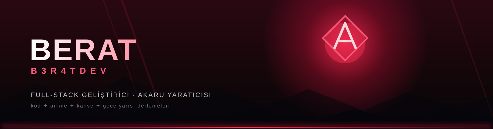

  

 

  

  <i>“Her satır kod, bir sonraki bölümün fragmanıdır.”</i>

---

## 🎬 Öne Çıkan Proje — AKARU

  
   
  <b>Sinematik anime izleme platformu</b> — koyu tema, kırmızı vurgular, tamamen özgün tasarım dili. 
  Hero slider · gelişmiş filtreleme · video oynatıcı · izleme listeleri · yayın takvimi
    
  
  

## 📊 GitHub İstatistiklerim

  
  
  

## 📈 Aktivite Grafiği

  

## 🐍 Katkı Yılanı

  <picture>
    <source media="(prefers-color-scheme: dark)" srcset="https://raw.githubusercontent.com/b3r4tdev/b3r4tdev/output/snake-dark.svg" />
    
  </picture>

## 🛠️ Kullandığım Teknolojiler

  

  

---

  
    
  

